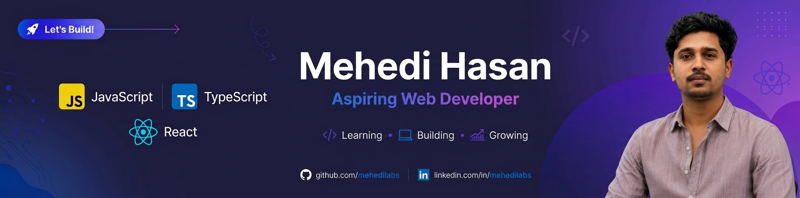

<!--- banner --->

 

<!--- title --->

  <ul align="center">
    
<h1 style="display: inline-block">Hi 👋, I'm Mehedi Hasan</h1>

    <!--- typo --->
    
  </ul>

 

---

## 👨 About Me

- 💻 Currently learning **React** while strengthening my **JavaScript and TypeScript** skills through real-world projects.
- 🚀 Working towards becoming a professional **full-stack web developer**.
- 🌱 Always exploring **modern web technologies** and building projects.

 

---

<!--- socials --->

## <b> FOLLOW ME ON SOCIALS:</b>

  

    
         
    

  

 

---

## 🧑‍💻 What I've Learned

  

  

  
  
  

  

  

  

 

---

## 📚 My Learning Journey

I'm following a full-stack web development roadmap, learning:

<table>
  <tr>
    <td align="center" width="150">
       
      <b>HTML</b>
    </td>
    <td align="center" width="150">
       
      <b>CSS</b>
    </td>
    <td align="center" width="150">
       
      <b>Tailwind CSS</b>
    </td>
  </tr>

  <tr>
    <td align="center" width="150">
       
      <b>JavaScript</b>
    </td>
    <td align="center" width="150">
       
      <b>TypeScript</b>
    </td>
    <td align="center" width="150">
       
      <b>React</b>
    </td>
  </tr>

  <tr>
    <td align="center" width="150">
       
      <b>Next.js</b>
    </td>
    <td align="center" width="150">
       
      <b>Node.js</b>
    </td>
    <td align="center" width="150">
       
      <b>Express.js</b>
    </td>
  </tr>

  <tr>
    <td align="center" width="150">
       
      <b>MongoDB</b>
    </td>
   <td align="center" width="150">
   
  <b>Mongoose</b>
</td>
    <td align="center" width="150">
      🔐 
      <b>Better Auth</b>
    </td>
  </tr>

  <tr>
    <td align="center" width="150">
       
      <b>Git</b>
    </td>
    <td align="center" width="150">
       
      <b>GitHub</b>
    </td>
    <td align="center" width="150">
      🤖 
      <b>AI-Assisted Coding</b>
    </td>
  </tr>

  <tr>
    <td align="center" colspan="3">
      🧠 
      <b>AI Mindset & Engineering</b>
    </td>
  </tr>
</table>

 

---

## 🌐 Connect With Me

  

 

---

<!--- random quote --->

## <b> RANDOM DEV QUOTE:</b>

---

